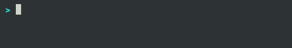

# npx stopwatch

> A terminal stopwatch


<p align="center">
  
</p>

## Getting started

```
npx -q npx-stopwatch
```

Tweak refresh rate

```
npx -q npx-stopwatch --interval 1000 # every 1000 ms
```

## License

MIT © Gerard Rovira Sánchez